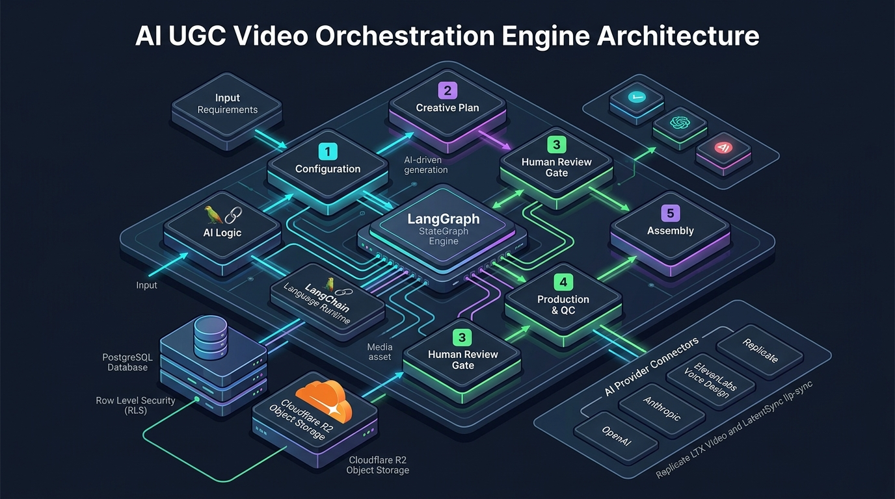
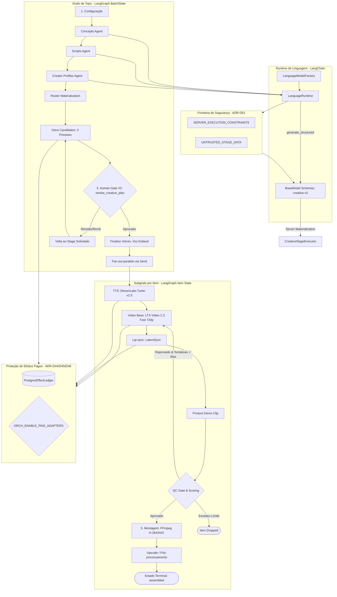

# UGC Orchestrator

Motor de orquestração assíncrono para a pipeline de **AI UGC em escala** (500+ vídeos/semana) descrita em [`Context.md`](Context.md). Construído com **TDD estrito** sobre **LangGraph**, **LangChain** e **LangSmith**, o sistema opera de forma determinística e modular, permitindo alternar ou misturar adapters reais e determinísticos (mock) por papel operacional através de perfis de configuração declarativos.

A API e a interface web V2 expõem a pipeline em **5 Fases Operacionais**:
1. **Configuração** — Parâmetros da campanha, oferta, plataformas alvo, guidelines de segurança e batch size.
2. **Plano Criativo** — Geração de conceitos e roteiros via runtime nativo LangChain (`creative-v2`) + geração de personas visuais e Voice Design (com 3 previews de áudio por criador).
3. **Revisão (Human Gate V2)** — Ponto único de aprovação criativa (`review_creative_plan`) com suporte a edição de conceitos/roteiros, seleção do candidato de voz e reroll com preservação de estado.
4. **Produção e QC** — Geração de locução (ElevenLabs), produção paralela de vídeo em 2 estágios (LTX-Video 2.3 Fast mudo em 720p + LatentSync para sincronização labial) e loop automatizado de Quality Control (QC).
5. **Montagem** — Alinhamento temporal, normalização de áudio e muxing/renderização determinística via FFmpeg/ffprobe, finalizando no estado terminal `assembled`.

*(Nota: Distribuição e publicação direta em redes sociais estão fora do escopo do orquestrador; o estado terminal aprovado da pipeline é `assembled`.)*

---

## Perfis de Configuração (`config*`)

O orquestrador carrega suas definições a partir de perfis YAML declarativos e desacoplados:

- **`config-mock/`** — Execução determinística local, sem chamadas externas de rede e com custo zero (ideal para testes rápidos, TDD e CI offline).
- **`config-staging/`** — Geração mock de mídia/linguagem conectada à infraestrutura real de persistência e filas (PostgreSQL 16 com RLS, S3/R2, Outbox e Worker leases). Padrão para desenvolvimento local durável.
- **`config/`** — Perfil live de produção com adapters de alta fidelidade:
  - **LLM / Linguagem**: Vercel AI Gateway / OpenAI / Anthropic via `LanguageModelFactory` (`BaseChatModel`).
  - **Criadores (Imagem & Voz)**: `OpenAIImageAdapter` (`AsyncOpenAI`) + Voice Design e TTS direto via ElevenLabs REST (`httpx.AsyncClient`).
  - **Vídeo & Lip-sync**: Replicate (LTX-Video 2.3 Fast + LatentSync) / PrunaAI.
  - **QC & Assembly**: Validação automatizada de áudio/vídeo e montagem determinística via FFmpeg.
  *(Em execuções duráveis com adapters pagos, exige `ORCH_ENABLE_PAID_ADAPTERS=true`, quotas configuradas e controle transacional por `PostgresEffectLedger`.)*

---

## Arquitetura e Engenharia





### 1. Runtime de Linguagem Nativo LangChain (ADR-D46 & ADR-D51)
- **`LanguageModelFactory`**: Instanciação centralizada e fail-fast de modelos `BaseChatModel` (`init_chat_model`) para mock, Anthropic, OpenAI e AI Gateways, unificando credenciais, timeouts, retries e observabilidade.
- **Contrato de Structured Output com Pydantic**: `LanguageRuntime.generate_structured` retorna exclusivamente instâncias tipadas do schema `creative-v2` (`ConceptAgentOutput`, `ScriptAgentOutput`, `CreatorAgentOutput`), desacoplando a geração do modelo da materialização server-side.
- **Fronteira Trusted / Untrusted**: Separação estrita entre `SERVER_EXECUTION_CONSTRAINTS` (contagens, IDs e regras server-owned) e `UNTRUSTED_STAGE_DATA` (input do usuário). O conteúdo do usuário nunca entra no system prompt, logs, APIs públicas ou traces.
- **Whitelisting Restrito de Agentes**: Apenas os 3 estágios criativos aceitam `executor: agent` (`concepts`, `scripts`, `creator_profiles`). Mídia, QC, storage e montagem operam como etapas determinísticas (`executor: tool`).

### 2. Vídeo em 2 Estágios & Lip-sync LatentSync (ADR-D4, ADR-D45, ADR-D47/D51)
- **Geração 2-Estágios**: O talking-head é produzido primeiro como vídeo base mudo em 720p via LTX-Video 2.3 Fast (Replicate), imediatamente persistido no storage canônico (R2/S3/local), e em seguida recebe sincronização labial perfeita com a locução via LatentSync.
- **Resiliência e Idempotência**: Predictions no Replicate possuem tracking durável no ledger de efeitos, cancelamento automático ao expirar timeout e reconciliação idempotente via polling ou webhook HMAC assinado.
- **Isolamento de Falha Parcial**: Falhas de provedores externos encerram apenas o subgrafo do item afetado (`FailureDetail`), permitindo que os demais itens do lote completem com sucesso.

### 3. Adapters de Domínio e Ledger de Efeitos Pagos (ADR-D44, ADR-D45, ADR-D48)
- **`CompositeAdapter`**: Isolado exclusivamente para operações de domínio e mídia.
- **`OpenAIImageAdapter`**: Utiliza o SDK oficial `AsyncOpenAI` com client injetável para testes, suporte a AI Gateway e retries de transporte customizados.
- **ElevenLabs Voice Design & TTS**: Operações REST otimizadas com `httpx.AsyncClient`, garantindo prevenção rigorosa contra dupla cobrança em erros de transporte.
- **`PostgresEffectLedger`**: Ledger transacional no PostgreSQL que protege chamadas a provedores pagos com controle de idempotência determinística e limites por quota:
  - `openai_image_units` — Unidades de geração de imagem.
  - `elevenlabs_voice_design_chars` — Caracteres consumidos no Voice Design.
  - `elevenlabs_voice_slots` — Slots de vozes criadas.
  - `elevenlabs_tts_chars` — Caracteres sintetizados em áudio de locução.
  - `replicate_video_seconds` — Segundos de vídeo gerados.
- **Sanitização de Resultados**: O ledger armazena apenas URIs canônicas e metadados leves (nunca payloads base64 volumosos ou URLs efêmeras pré-assinadas).

### 4. Checkpointing, Concorrência e Multi-Tenancy
- **Checkpointer Assíncrono**: `AsyncPostgresSaver` com **Row Level Security (RLS)** por `organization_id` no PostgreSQL 16 via SQLAlchemy 2.0 Async ORM.
- **Outbox Pattern & Worker Leases**: Concorrência otimista com `FOR UPDATE SKIP LOCKED` e renovação periódica de leases a cada 30 segundos.
- **Runtime Contract Canônico**: Persistência de fingerprint determinístico dos runs para validar compatibilidade do runtime antes de chamadas pagas.
- **Forks Limpos em Retry**: O retry de uma campanha com falha cria um novo `run_id` (`web-...`), preservando o histórico completo para auditoria.

### 5. Módulo de Avaliação Determinístico (ADR-D47)
- Localizado em `src/orchestrator/evaluation/` (`GatewayJudge`, `Cassette`, evaluators), o LLM-as-judge opera offline via cassettes pré-gravados em `tests/cassettes/`, com revalidação opt-in contra gateways reais via flag `--live`. Totalmente desacoplado do runtime de produção.

---

## Setup e Instalação

### Pré-requisitos
- Python 3.12+
- `uv` (gerenciador de pacotes e ambientes virtuais Python)
- Node.js 20+ LTS e `npm` (para o dashboard web em `front/`)
- FFmpeg & ffprobe instalados no sistema
- Docker & Docker Compose (para ambiente local com PostgreSQL 16)

### Instalação Rápida

```bash
# 1. Clone o repositório e crie o ambiente virtual
uv venv --python 3.12
source .venv/bin/activate

# 2. Instale o pacote em modo editável com dependências completas
uv pip install -e ".[dev,web]"

# 3. Instale dependências e compile o frontend SPA
cd front && npm install && npm run build && cd ..
```

---

## Desenvolvimento Local com `./scripts/dev-local`

O utilitário `./scripts/dev-local` gerencia a stack completa em containers (PostgreSQL 16 com RLS, migrações Alembic, API FastAPI com Runner embutido e dev server Vite com hot-reload):

```bash
# 1. Configure as variáveis de ambiente
cp .env.example .env

# 2. Suba a infraestrutura de desenvolvimento local
./scripts/dev-local up
```

Endpoints disponíveis:
- **Dashboard Web**: `http://localhost:5173`
- **API FastAPI / Healthcheck**: `http://localhost:8000/readyz`
- **PostgreSQL Local**: `127.0.0.1:55432`

### Gestão de Quotas Locais (Perfil Live)
Para testar chamadas reais no perfil `config/`:
```bash
# Configurar quotas de voz (ElevenLabs)
./scripts/dev-local quotas \
  --design-chars 500 \
  --voice-slots 2 \
  --tts-chars 1000

# Configurar quota de vídeo (Replicate)
./scripts/dev-local video-quota --seconds 120

# Configurar quota de imagens (OpenAI)
./scripts/dev-local image-quota --units 10
```

Para encerrar e gerenciar o ambiente:
```bash
# Pausar containers
./scripts/dev-local down

# Resetar completamente banco e volumes locais
./scripts/dev-local reset --yes
```

---

## Dashboard Web ("Kinetic Command")

Interface SPA moderna desenvolvida em **React 19 + TypeScript + Vite + Tailwind CSS** localizada em `front/`, conectada à API REST e stream SSE em tempo real via **TanStack Query**.

Compreende 12 visões operacionais:
1. **Dashboard**: Visão executiva com métricas consolidadas, throughput e campanhas ativas.
2. **Campaigns**: Lista e monitoramento de todas as execuções e status da pipeline.
3. **Campaign Detail**: Painel detalhado do run, timeline em tempo real, visualização do **Human Gate V2** (com 3 previews de áudio por criador, seleção e reroll) e retry manual seguro.
4. **Create Wizard**: Wizard guiado para parametrização de novas campanhas.
5. **Concepts**: Galeria de conceitos criativos gerados e ângulos de marketing.
6. **Scripts**: Roteiros completos gerados e associados a cada conceito.
7. **Creators Library**: Catálogo de personas visuais e perfis de voz gerados.
8. **Job Queue**: Monitoramento de jobs duráveis, leases e status do worker runner.
9. **Video Review & QC**: Central de inspeção de vídeos gerados, clips intermediários e relatórios de conformidade de QC.
10. **Publishing Calendar**: Calendário de agendamento e previsão de entregas.
11. **Analytics**: Desempenho criativo e telemetria de custos por etapa.
12. **Integrations & Settings**: Status de conexões com provedores, quotas e configurações gerais.

Comandos úteis do frontend:
```bash
cd front
npm run typecheck    # Checagem estática de tipos TypeScript
npm run build        # Build de produção para front/dist/
npm run dev          # Dev server Vite com proxy para a API (:8000)
```

---

## CLI Operacional (`orchestrator`)

O executável `orchestrator` fornece comandos operacionais e administrativos:

```bash
# Inicia a API REST/SSE V2
orchestrator api --port 8000

# Consome exatamente um job durável da fila PostgreSQL (--once é obrigatório)
orchestrator runner --once

# Serviços de container / OCI
orchestrator runner-service
orchestrator sqs-runner

# Banco de dados e migrações
orchestrator migrate
orchestrator import-legacy --apply
orchestrator db org-create --slug acme --name "Acme Corp"
orchestrator db membership-grant --organization-slug acme --user-subject "user@acme.com" --role admin
orchestrator db set-provider-quota --provider replicate_video_seconds --limit-units 300
orchestrator db set-voice-quota --bucket elevenlabs_voice_design_chars --limit-units 100000

# Operações, diagnóstico e armazenamento
orchestrator ops inspect-run <run_id>
orchestrator ops maintain --purge-expired
orchestrator storage migrate-run <run_id>
```

---

## Testes e Qualidade (TDD Estrito)

O projeto segue TDD estrito com a regra inegociável de **nunca afrouxar asserções ou mascarar falhas**:

```bash
# Executar a suíte de testes unitários e de integração
uv run pytest --no-cov

# Executar testes específicos de runtime, executor e tracing
uv run pytest --no-cov tests/test_stage_executor.py tests/test_language_runtime.py tests/test_tracing_coverage.py

# Executar avaliação do LLM Judge (offline via cassettes)
uv run pytest --no-cov tests/test_judge_eval.py

# Reavaliar e regravar cassettes contra o gateway real (opt-in)
uv run pytest --no-cov tests/test_judge_eval.py --live

# Verificação estática e linting
uv run ruff check src tests
```

---

## Documentação de Referência

- [`AGENTS.md`](AGENTS.md) — Regras de desenvolvimento, convenções de código e diretrizes do agente.
- [`Context.md`](Context.md) — Visão de negócio e requisitos da pipeline de AI UGC.
- [`docs/DECISIONS.md`](docs/DECISIONS.md) — Registro de Decisões Arquiteturais (ADRs D1 a D51).
- [`docs/PROGRESS.md`](docs/PROGRESS.md) — Painel de entregas recentes e índice de mudanças.
- [`docs/DEMO.md`](docs/DEMO.md) — Roteiro de demonstração ponta a ponta e saídas esperadas.
