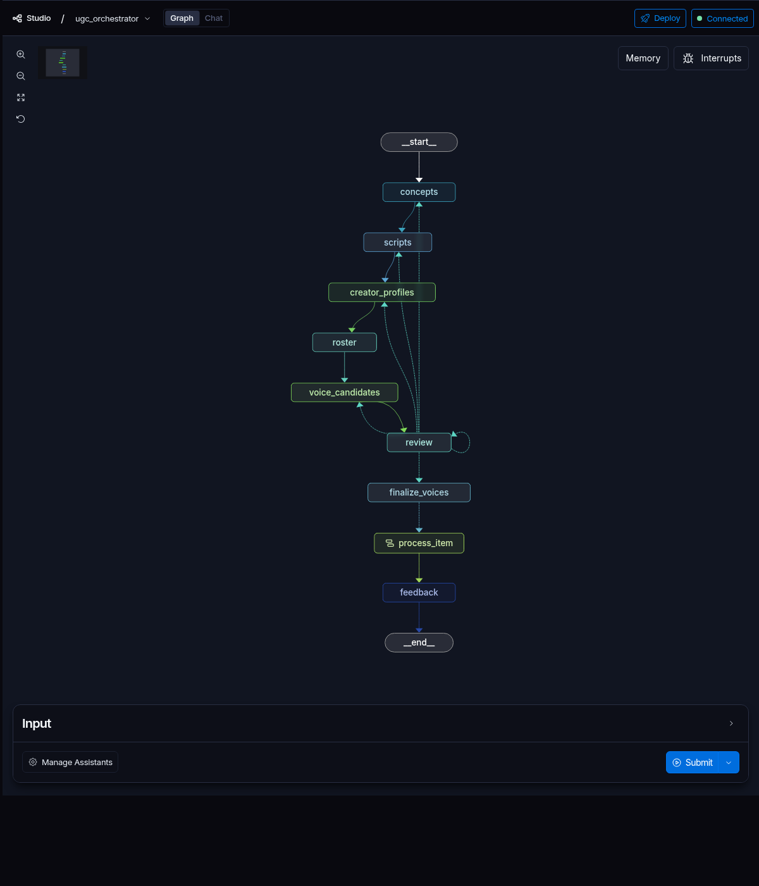

# UGC Orchestrator

Motor de orquestração para transformar um briefing de campanha em vídeos de AI UGC
revisados, validados e montados. O projeto coordena planejamento criativo, aprovação
humana, geração de mídia, controle de qualidade e montagem final sem expor ao usuário a
complexidade dos serviços de IA envolvidos.

Foi desenhado para execução em lotes e para uma operação-alvo de **500+ vídeos por
semana**, com três prioridades: retomada segura após falhas, controle de custos e troca
de provedores sem reescrever o fluxo principal.

> O escopo termina no vídeo montado, no estado `assembled`. Publicação e distribuição
> em redes sociais não fazem parte deste repositório.

## Entenda o projeto em 30 segundos

1. Uma pessoa informa oferta, público, plataforma e tamanho da campanha.
2. Agentes de linguagem criam conceitos, roteiros e dois perfis de creator.
3. A pessoa revisa o plano uma única vez, podendo editar, aprovar ou pedir nova geração.
4. O sistema produz os vídeos em paralelo, aplica sincronização labial e executa QC.
5. Os itens aprovados são montados com FFmpeg e ficam disponíveis para download.

| Se você é... | Comece por... |
| --- | --- |
| Recrutador(a) | [O que este projeto demonstra](#o-que-este-projeto-demonstra) e [decisões e trade-offs](#decisões-e-trade-offs) |
| Pessoa de produto ou não técnica | [A experiência em cinco fases](#a-experiência-em-cinco-fases) |
| Pessoa desenvolvedora | [Como o motor funciona](#como-o-motor-funciona) e [como rodar](#como-rodar-o-projeto) |
| Pessoa operadora | [Cotas e controle de gastos](#cotas-e-controle-de-gastos) e [diagnóstico rápido](#diagnóstico-rápido) |

## Snapshots do sistema

### Grafo executável no LangGraph Studio

Esta é a topologia realmente carregada pelo perfil `config-mock`. A linha central
representa a jornada do lote; as setas de retorno representam pedidos de revisão. O node
`process_item` encapsula o trabalho paralelo de cada vídeo.



Leitura rápida:

- `concepts → scripts → creator_profiles` produz o plano criativo;
- `review` é o único ponto de decisão humana;
- `process_item` distribui os vídeos para produção e QC;
- `feedback` consolida o aprendizado operacional antes de `__end__`.

### Arquitetura


O **LangGraph** ocupa o centro da solução. PostgreSQL guarda estado, jobs, gates e
controles financeiros; R2/S3 guarda os arquivos; LangChain executa apenas os agentes
criativos; e adapters isolam os provedores de imagem, voz e vídeo.

## Decisões e trade-offs

As escolhas abaixo não são “certas para todo sistema”; elas atendem às necessidades
desta pipeline.

| Decisão | O que ganhamos | O custo da escolha |
| --- | --- | --- |
| Um grafo explícito de estados | Execuções observáveis, retomáveis e fáceis de auditar | Mais estrutura do que uma sequência simples de funções |
| Um único gate humano | Experiência clara e controle de gasto antes da produção | Menos aprovações intermediárias |
| Produção paralela por item | Um vídeo com falha não precisa parar todo o lote | Exige idempotência e controle de concorrência |
| Vídeo base e lip-sync em etapas separadas | Podemos preservar o clip base e repetir apenas a sincronização | Mais latência e duas operações de vídeo |
| PostgreSQL como fonte canônica | Estado durável, multi-tenant e workers recuperáveis | Infraestrutura mais pesada que SQLite |
| Ledger e cotas antes de chamadas pagas | Evita cobrança duplicada e gastos sem limite | Chamadas live duráveis dependem do banco e de configuração administrativa |
| Perfis mock, staging e live | Desenvolvimento barato e passagem gradual para produção | É preciso manter os perfis coerentes |
| Adapters por domínio | Trocar um provedor não altera o grafo | Cada integração precisa cumprir um contrato comum |

## A experiência em cinco fases

| Fase | O que acontece | Resultado visível |
| --- | --- | --- |
| **1. Configuração** | A campanha recebe oferta, público, plataforma, segurança e tamanho do lote | Briefing validado |
| **2. Plano criativo** | Agentes geram conceitos, roteiros, creators e três previews de voz por creator | Plano pronto para avaliação |
| **3. Revisão** | A pessoa aprova, edita ou solicita reroll | Uma decisão humana versionada |
| **4. Produção e QC** | Locução, vídeo base, lip-sync e validações rodam por item | Itens aprovados, repetidos ou descartados |
| **5. Montagem** | FFmpeg alinha, normaliza e combina áudio e vídeo | Artefato final `assembled` |

Os detalhes internos continuam disponíveis para diagnóstico, mas a API/UI V2 apresenta
somente essas cinco fases. O usuário acompanha a campanha, não cada chamada de provedor.

## O que este projeto demonstra

- **Arquitetura orientada a workflow:** estados, desvios, fan-out, interrupção humana e
  retomada são modelados no LangGraph.
- **Integração responsável com IA:** dados do usuário são tratados como não confiáveis,
  respostas de agentes são validadas por schema e efeitos pagos passam por guardrails.
- **Engenharia de confiabilidade:** jobs têm lease, chamadas externas são idempotentes,
  falhas parciais são isoladas e retries preservam a auditoria.
- **Controle operacional:** custos são reservados antes da chamada, há cotas por
  organização e o sistema diferencia falha definitiva de resultado incerto.
- **Multi-tenancy real:** PostgreSQL aplica RLS e a identidade da organização é definida
  pelo servidor.
- **Qualidade verificável:** mocks determinísticos, cassettes do LLM Judge, TDD estrito e
  cobertura mínima configurada em 97%.
- **Separação de responsabilidades:** linguagem, mídia, avaliação, persistência, filas e
  interface podem evoluir sem transformar o grafo em um módulo monolítico.

## Como o motor funciona

### Fluxo do lote

```text
briefing
  → conceitos
  → roteiros
  → perfis de creator
  → imagens e candidatos de voz
  → revisão humana
  → produção paralela
  → QC e tentativas controladas
  → montagem
  → assembled
```

O grafo de topo trabalha com `BatchState`. Depois da aprovação, `Send` cria um
subgrafo para cada item. Conditional edges escolhem tiers de vídeo e decidem se o item
volta ao gerador, segue para montagem ou é descartado após esgotar as tentativas.

Há exatamente um interrupt público: `review_creative_plan`. Em execução durável, ele
vive em `run_gates` e é resolvido com `gate_id` e `version`, impedindo que uma aba
antiga aprove uma revisão já substituída.

### Linguagem e agentes criativos

Somente `concepts`, `scripts` e `creator_profiles` podem operar como agentes. Eles
usam LangChain, `create_agent`, `ToolStrategy` e saída estruturada Pydantic no schema
`creative-v2`.

Contagens, IDs, modelos permitidos, budgets e regras de segurança pertencem ao servidor.
O briefing é serializado como `UNTRUSTED_STAGE_DATA`; ele não é concatenado ao system
prompt. API, SSE, logs e traces podem mostrar versão e hash do prompt, nunca seu corpo.

### Produção de mídia

No perfil live:

1. a imagem do creator é gerada por GPT Image via Vercel AI Gateway;
2. o ElevenLabs Voice Design cria candidatos de voz;
3. após a revisão, o candidato escolhido vira uma voz estável;
4. ElevenLabs produz a locução do roteiro;
5. Replicate produz o vídeo base e executa o LatentSync;
6. o QC valida os artefatos e controla novas tentativas;
7. FFmpeg/ffprobe monta o resultado em H.264/AAC.

`CompositeAdapter` cuida somente dos domínios de mídia
(`creator`, `video`, `qc`, `assembly` e `upscale`). O runtime de linguagem e o
LLM Judge ficam separados para evitar acoplamento entre geração criativa e avaliação.

### Estado, filas e arquivos

| Responsabilidade | Implementação |
| --- | --- |
| Orquestração | LangGraph `StateGraph` assíncrono |
| Checkpoint local | SQLite com `AsyncSqliteCompatSaver` |
| Checkpoint durável | PostgreSQL com `AsyncPostgresSaver` |
| Runs, jobs, gates, eventos e cotas | PostgreSQL 16 com RLS |
| Arquivos de imagem, áudio e vídeo | Disco local, Cloudflare R2 ou S3 |
| Wake-up de workers | PostgreSQL, Cloudflare Queue ou SQS |
| API e eventos | FastAPI + REST + SSE |
| Dashboard | React 19 + TypeScript + Vite + Tailwind CSS |
| Observabilidade | Logs estruturados e tracing opcional no LangSmith |

Cloudflare Queue e SQS servem apenas como wake-up. O job canônico permanece no
PostgreSQL, portanto perder uma mensagem não significa perder a campanha.

### Falhas, retry e idempotência

- Cada efeito pago recebe uma chave determinística.
- Repetir a mesma chave e o mesmo payload reaproveita o resultado conhecido.
- Timeout depois do envio vira efeito `uncertain`, que exige reconciliação em vez de
  uma segunda cobrança cega.
- Falha definitiva não faturada libera a reserva de cota uma única vez.
- Uma falha de vídeo afeta somente aquele item; os demais podem concluir.
- O retry manual de uma campanha falhada sempre cria outro `run_id`. O run antigo
  continua em `error` como histórico.

### Perfis de configuração

Os arquivos em `config-base/` definem a base comum. Cada perfil contém somente seus
overrides.

| Perfil | Geração | Infraestrutura | Custo externo | Uso recomendado |
| --- | --- | --- | --- | --- |
| `config-mock/` | Toda mock e determinística | SQLite/disco ou stack local | Zero | Desenvolvimento, CI e demonstração |
| `config-staging/` | Toda mock | PostgreSQL, R2/fila e runner reais | Zero em geração | Validar operação durável |
| `config/` | Adapters reais | Infraestrutura durável | Sim | Canário e produção controlada |

Em execução durável, selecionar `config/` não basta para gastar: os adapters pagos
também exigem credenciais, `ORCH_ENABLE_PAID_ADAPTERS=true`, ledger e cotas válidas.

### Dashboard

A SPA permite criar campanhas, acompanhar a timeline por SSE, revisar conceitos e
roteiros, escolher vozes, inspecionar creators, acompanhar jobs, revisar vídeos/QC e
consultar integrações. O calendário representa planejamento; ele não publica conteúdo.

### Estrutura do repositório

```text
config-base/              configuração compartilhada
config*/                  overrides mock, staging e live
src/orchestrator/
  graph/                  estado, routing, builder e checkpointer
  nodes/                  fases e subgrafos da pipeline
  adapters/               integrações mock e reais
  evaluation/             LLM Judge e cassettes
  db/                     PostgreSQL, RLS, jobs, gates e Alembic
  storage/                disco local, R2, S3 e dual-write
  web/                    FastAPI, endpoints V2 e SSE
  tools/                  efeitos tipados chamados pelos nodes
front/                    dashboard React/Vite
infra/                    Cloudflare, Neon e AWS com OpenTofu
deploy/                   assets de Worker e containers
tests/                    testes e cassettes
docs/                     decisões, progresso e runbooks
```

## Limites atuais

- Distribuição e postagem não fazem parte do motor.
- O perfil mock prova comportamento e integração, não qualidade visual dos provedores.
- Qualidade, latência e disponibilidade do perfil live também dependem dos serviços
  externos.
- O servidor in-memory do LangGraph Studio é destinado a desenvolvimento, não produção.
- Um item que excede as tentativas de QC é descartado de forma explícita; não é
  apresentado como vídeo aprovado.

---

## Como rodar o projeto

### Pré-requisitos

- Docker com Docker Compose V2;
- Python 3.12 recomendado, embora o pacote declare compatibilidade a partir do 3.11;
- `uv`;
- Node.js 20+ e npm;
- FFmpeg e ffprobe para montagem real.

### Instalação local

```bash
uv venv --python 3.12
uv sync --frozen --all-extras

cd front
npm ci
cd ..

cp .env.example .env
```

Nunca faça commit do arquivo `.env`.

### Opção A — demonstração completa, sem chaves e sem custo

Este é o melhor primeiro contato com o projeto:

```bash
ORCH_DEV_CONFIG_DIR=config-mock \
ORCH_DEV_STORAGE_BACKEND=local \
./scripts/dev-local up
```

Depois do boot:

- Dashboard: http://localhost:5173
- API/healthcheck: http://localhost:8005/readyz
- PostgreSQL: `127.0.0.1:55432`

Crie uma campanha pelo dashboard, aguarde **Revisão**, aprove o plano e acompanhe os
itens até **Montagem**. Todos os resultados são determinísticos e nenhuma API paga é
chamada.

### Opção B — infraestrutura durável com geração mock

```bash
# Usa PostgreSQL real e storage local:
ORCH_DEV_CONFIG_DIR=config-staging \
ORCH_DEV_STORAGE_BACKEND=local \
./scripts/dev-local up
```

Para validar R2, preencha `R2_ACCOUNT_ID`, `R2_ACCESS_KEY_ID`,
`R2_SECRET_ACCESS_KEY` e `R2_BUCKET` no `.env`, remova o override de storage e rode:

```bash
ORCH_DEV_CONFIG_DIR=config-staging ./scripts/dev-local up
```

Esse modo testa jobs, gates, eventos, checkpoints e retomada no PostgreSQL sem consumir
créditos de geração.

### Opção C — perfil live

Preencha no `.env`, no mínimo:

- `AI_GATEWAY_API_KEY`;
- `REPLICATE_API_TOKEN`;
- `ELEVENLABS_API_KEY`;
- as quatro credenciais de R2.

Em seguida:

```bash
./scripts/dev-local up
```

Comece com uma campanha de batch 1. O perfil live faz chamadas cobradas; confirme
créditos e limites nos provedores antes de habilitá-lo.

### API e frontend sem Docker

Para uma execução leve com SQLite e arquivos locais:

```bash
# Terminal 1
ORCH_CONFIG_DIR=config-mock uv run orchestrator api --port 8000 --reload

# Terminal 2
cd front
npm run dev
```

Nesse modo, o frontend fica em http://localhost:5173 e usa a API em
http://127.0.0.1:8000.

## Cotas e controle de gastos

As cotas deste projeto são **guardrails internos gravados no PostgreSQL e separados por
organização**. Elas não representam saldo, assinatura ou rate limit da ElevenLabs,
Replicate, OpenAI ou Vercel. Uma chamada precisa passar pelas duas camadas: limite local
e disponibilidade no provedor.

### O que cada cota mede

| Bucket | Unidade reservada |
| --- | --- |
| `openai_image_units` | Uma unidade por geração de imagem |
| `elevenlabs_voice_design_chars` | Caracteres do texto usado no preview de Voice Design |
| `elevenlabs_voice_slots` | Um slot por voz candidata finalizada |
| `elevenlabs_tts_chars` | Caracteres do roteiro enviados ao TTS |
| `replicate_video_seconds` | Segundos solicitados nas operações de vídeo e lip-sync |

O consumo é acumulado no ledger. Antes de chamar o provedor, o sistema testa:

```text
consumo atual + nova reserva <= limite configurado
```

Por isso:

- `quota de 'elevenlabs_voice_design_chars' excedida: 524/500` significa que o
  consumo acumulado mais o novo preview chegaria a 524 caracteres, mas o limite local é
  500;
- `quota de 'elevenlabs_voice_slots' excedida: 3/2` significa que a próxima
  finalização exigiria o terceiro slot, mas o limite local é 2.

Esses erros acontecem **antes da nova chamada paga**. Para resolvê-los, aumente o limite
de forma consciente, reduza batch/rerolls ou reutilize creators já aprovados.

### Valores iniciais do ambiente de desenvolvimento

Na primeira migração local, buckets ainda inexistentes recebem:

| Bucket | Limite inicial |
| --- | ---: |
| `openai_image_units` | 50 |
| `elevenlabs_voice_design_chars` | 100.000 |
| `elevenlabs_voice_slots` | 50 |
| `elevenlabs_tts_chars` | 200.000 |
| `replicate_video_seconds` | 300 |

Valores já configurados não são sobrescritos automaticamente.

### Configurar cotas no Docker

Com a API live já rodando, abra outro terminal:

```bash
./scripts/dev-local quotas \
  --design-chars 100000 \
  --voice-slots 50 \
  --tts-chars 200000

./scripts/dev-local image-quota --units 50
./scripts/dev-local video-quota --seconds 300
```

Os comandos atualizam o teto, mas **não zeram o consumo existente**. O sistema também
recusa reduzir uma cota para menos do que já foi consumido. Isso preserva a auditoria e
evita transformar uma alteração administrativa em apagamento contábil.

Planeje o limite considerando quantidade de creators, rerolls, caracteres dos roteiros,
duração dos clips e possíveis tentativas de QC. Para canários, prefira batch 1 e aumentos
graduais.

## Testes e qualidade

```bash
# Suíte completa; o proxy revela a saída que o hook do rtk pode colapsar
rtk proxy python -m pytest

# Judge offline por cassette
rtk proxy python -m pytest tests/test_judge_eval.py

# Judge real, opt-in
rtk proxy python -m pytest tests/test_judge_eval.py --live

# Lint
uv run ruff check src tests

# Frontend
cd front
npm run typecheck
npm run build
```

Testes PostgreSQL exigem um servidor disponível em `127.0.0.1:5432`. Falha por
ausência dessa infraestrutura não autoriza relaxar asserções.

## Encerrar ou limpar o ambiente

```bash
# Encerra os containers e preserva os volumes
./scripts/dev-local down

# Remove containers e volumes locais; exige confirmação explícita
./scripts/dev-local reset --yes
```

`reset --yes` remove o banco e os volumes Docker locais. Ele não apaga o bucket R2.

## Diagnóstico rápido

| Sintoma | Causa provável | Ação |
| --- | --- | --- |
| `permission denied ... /var/run/docker.sock` | A sessão atual ainda não recebeu o grupo `docker` | Encerre/login novamente ou use `newgrp docker`; confirme com `docker ps` sem `sudo` |
| API Docker não responde em `:8000` | A porta interna 8000 é publicada como 8005 | Use http://localhost:8005/readyz |
| Erro `N/M` de quota | A nova reserva ultrapassa o teto local | Consulte o bucket, ajuste a cota ou reduza a campanha |
| `latentsync_audio_missing` | O lip-sync não recebeu um artefato de áudio utilizável | Verifique a locução/URI canônica e os logs do item; o clip base permanece disponível |
| Run falhou e precisa de retry | Runs falhos são históricos imutáveis | Use o retry da UI, que cria outro `run_id` |

## CLI operacional

```bash
orchestrator runner --once
orchestrator migrate
orchestrator ops inspect-run <run_id>
orchestrator ops maintain
orchestrator storage migrate-run <run_id>
```

## Documentação de referência

- [Context.md](Context.md) — problema de negócio e requisitos;
- [decisões arquiteturais](docs/DECISIONS.md) — ADRs e justificativas;
- [progresso](docs/PROGRESS.md) — estado atual e entregas recentes;
- [AGENTS.md](AGENTS.md) — convenções de engenharia e contribuição.
