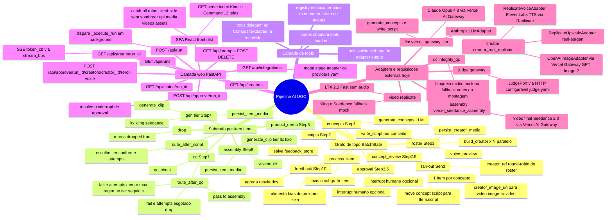
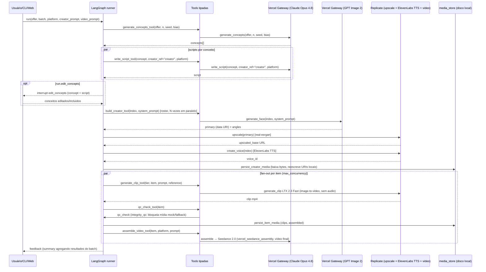

# Fluxo atual da pipeline — mindmap visual

Gerado a partir do estado atual do código (`src/orchestrator/`). Cobre: grafo
LangGraph (topo + subgrafo por item), quem chama quem, e quais requisições
externas cada stage dispara hoje segundo `config/providers.yaml`.

## 1. Visão geral (mindmap)

### Camada `nodes -> tools -> adapters`

Os nodes de `src/orchestrator/nodes/stages.py` não chamam mais métodos do adapter
diretamente. Cada stage monta um `ToolContext` a partir do `RunnableConfig` e chama
uma tool fina em `src/orchestrator/tools/`; a tool adiciona metadata de tracing,
valida o shape retornado e só então devolve o tipo que o node já esperava. O
`CompositeAdapter` continua sendo a fonte de roteamento por papel (`llm`,
`creator`, `video`, `qc`, `assembly`, `upscale`), sem mudar a topologia LangGraph.

## 2. Diagrama de sequência das requisições externas

## 3. Tabela: stage → provider real hoje

| Step | Node | Tool | Provider configurado | Requisição externa? |
|------|------|------|----------------------|----------------------|
| 1 | `node_concepts` | `generate_concepts_tool` | `vercel_gateway_llm` | Sim — Claude Opus 4.8 via Vercel AI Gateway |
| 2 | `node_scripts` | `write_script_tool` | `vercel_gateway_llm` | Sim — Claude Opus 4.8 via Vercel AI Gateway |
| 2.5 | `node_concept_review` | — | — | `interrupt()` humano (opcional, `run.edit_concepts`) |
| 3 | `node_roster` | `build_creator_tool` | `creator_real_replicate` | Sim — Vercel Gateway (GPT Image 2), Replicate (upscale + ElevenLabs TTS) |
| 3.5 | `node_approval` | — | — | `interrupt()` humano (opcional, `run.approve_creators`) |
| 4 | `make_gen_node(tier)` | `generate_clip_tool` | `replicate` | Sim para `ltx` — LTX 2.3 Fast image-to-video sem áudio; `kling`/`seedance` fallback mock |
| 5 | `node_product_demo` | `generate_clip_tool` | `replicate` | Sim — LTX 2.3 Fast image-to-video sem áudio |
| 7 | `node_qc` | `qc_check_tool` | `integrity_qc` | Não — valida mídia real e bloqueia URIs mock/fallback antes da montagem |
| 8 | `node_assembly` | `assemble_video_tool` | `vercel_seedance_assembly` | Sim — vídeo final Seedance 2.0 (`bytedance/seedance-2.0`) via Vercel AI Gateway |
| 8 | `node_upscale` | `upscale_video_tool` | `passthrough_upscale` | Não no perfil atual — role existe para plugar upscale real depois |
| — | `JudgePort` (gateway) | — | `gateway` | Sim, quando usado — HTTP configurável (`config/judge.yaml`) |

## 4. Notas de arquitetura

- **Topologia fixa, comportamento por config**: o grafo (`graph/builder.py`) não
  muda entre mock e real — só `config/providers.yaml` troca o adapter por role
  (`registry.py` resolve provider → implementação).
- **Tools finas antes dos adapters**: `tools/` é uma camada de contrato e tracing,
  não um runtime de agents. Ela recebe o adapter já resolvido pelo grafo e valida
  outputs (`Artifact`, `QCResult`, `dict`, `str`) antes de o node persistir mídia ou
  decidir rotas.
- **Retry**: chamadas HTTP passam por `adapters/_retry.py`
  (`with_transport_retry`), que retenta `httpx.TransportError`, `ReplicateError`
  429 e `httpx.HTTPStatusError` 429; outros status (401/422/500) propagam na 1ª
  tentativa.
- **Streaming para UI**: `stream_bus.emit_token` empurra eventos
  (`creator_start`, `creator_ready`, etc.) consumidos via SSE em
  `GET /api/stream/{run_id}` no `web/server.py`.
- **Persistência de mídia**: `media_store.py` baixa bytes remotos (imagem,
  voz, clipes) e reescreve URIs para caminhos locais servíveis sob
  `/media/{run_id}/...`, tornando o dashboard independente das URLs
  originais dos providers.
- **QC loop**: `route_after_qc` decide entre reprocessar no tier configurado,
  ir para `assembly`, ou `drop` após `qc.max_attempts` (default 3).
- **Feedback loop (Step 10 → 1)**: `node_feedback` grava um resumo em
  `feedback_store`; o próximo ciclo (`orchestrator loop`) usa
  `prior_winning_styles` como `bias` em `generate_concepts`.
