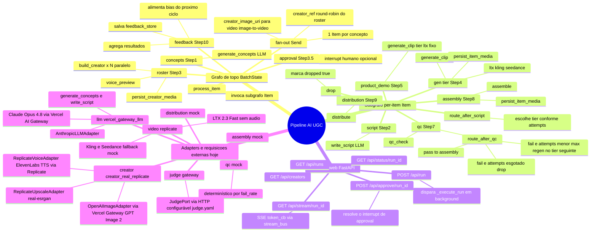
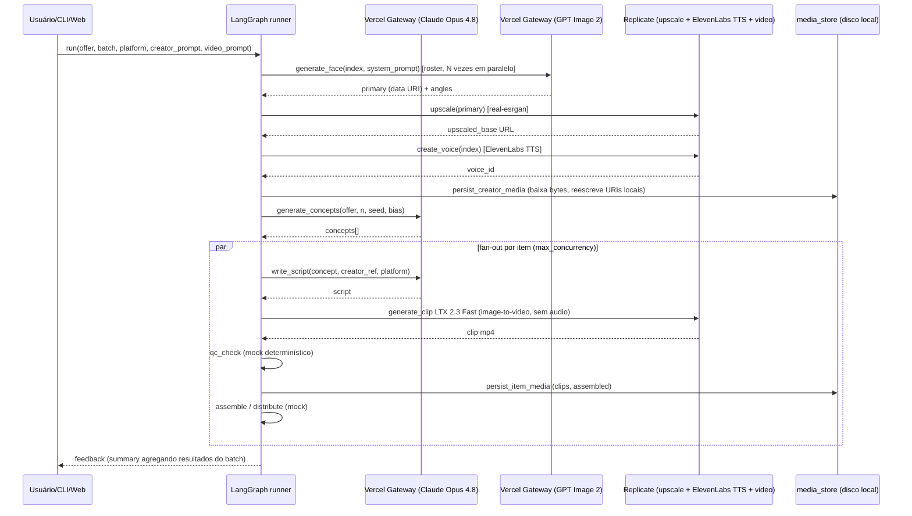

# Fluxo atual da pipeline — mindmap visual

Gerado a partir do estado atual do código (`src/orchestrator/`). Cobre: grafo
LangGraph (topo + subgrafo por item), quem chama quem, e quais requisições
externas cada stage dispara hoje segundo `config/providers.yaml`.

## 1. Visão geral (mindmap)

## 2. Diagrama de sequência das requisições externas

## 3. Tabela: stage → provider real hoje

| Step | Node | Provider configurado | Requisição externa? |
|------|------|----------------------|----------------------|
| 3 | `node_roster` → `build_creator` | `creator_real_replicate` | Sim — Vercel Gateway (GPT Image 2), Replicate (upscale + ElevenLabs TTS) |
| 3.5 | `node_approval` | — | `interrupt()` humano (opcional, `run.approve_creators`) |
| 1 | `node_concepts` | `vercel_gateway_llm` | Sim — Claude Opus 4.8 via Vercel AI Gateway |
| 2 | `node_script` | `vercel_gateway_llm` | Sim — Claude Opus 4.8 via Vercel AI Gateway |
| 4 | `make_gen_node(tier)` | `replicate` | Sim para `ltx` — LTX 2.3 Fast image-to-video sem áudio; `kling`/`seedance` fallback mock |
| 5 | `node_product_demo` | `replicate` | Sim — LTX 2.3 Fast image-to-video sem áudio |
| 7 | `node_qc` | `mock` | Não — determinístico via `fail_rate` |
| 8 | `node_assembly` | `mock` | Não — mock |
| 9 | `node_distribution` | `mock` | Não — mock |
| — | `JudgePort` (gateway) | `gateway` | Sim, quando usado — HTTP configurável (`config/judge.yaml`) |

## 4. Notas de arquitetura

- **Topologia fixa, comportamento por config**: o grafo (`graph/builder.py`) não
  muda entre mock e real — só `config/providers.yaml` troca o adapter por role
  (`registry.py` resolve provider → implementação).
- **Retry**: chamadas HTTP passam por `adapters/_retry.py`
  (`with_transport_retry`), que retenta `httpx.TransportError`, `ReplicateError`
  429 e `httpx.HTTPStatusError` 429; outros status (401/422/500) propagam na 1ª
  tentativa.
- **Streaming para UI**: `stream_bus.emit_token` empurra eventos
  (`creator_start`, `creator_ready`, etc.) consumidos via SSE em
  `GET /api/stream/{run_id}` no `web/server.py`.
- **Persistência de mídia**: `media_store.py` baixa bytes remotos (imagem,
  voz, clipes) e reescreve URIs para caminhos locais servíveis sob
  `/media/{run_id}/...`, tornando o dashboard independente das URLs
  originais dos providers.
- **QC loop**: `route_after_qc` decide entre reprocessar no próximo tier
  (mais caro), ir para `assembly`, ou `drop` após `qc.max_attempts` (default 3).
- **Feedback loop (Step 10 → 1)**: `node_feedback` grava um resumo em
  `feedback_store`; o próximo ciclo (`orchestrator loop`) usa
  `prior_winning_styles` como `bias` em `generate_concepts`.
