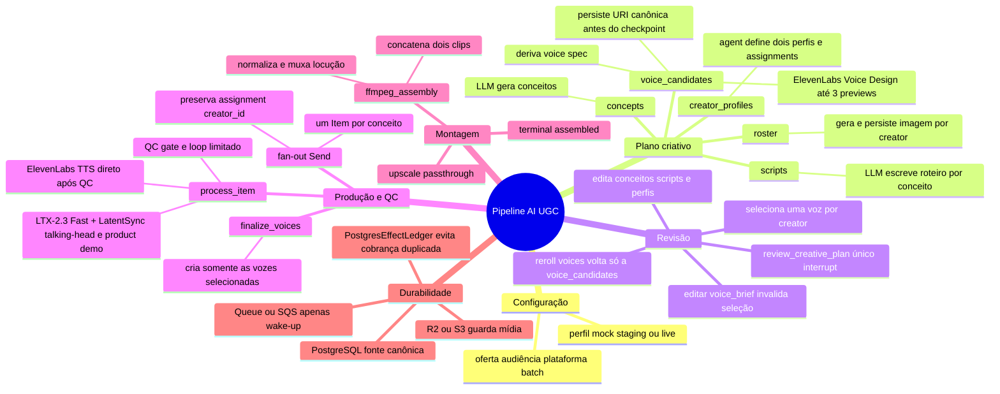
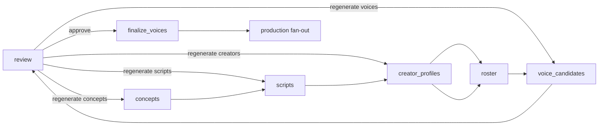
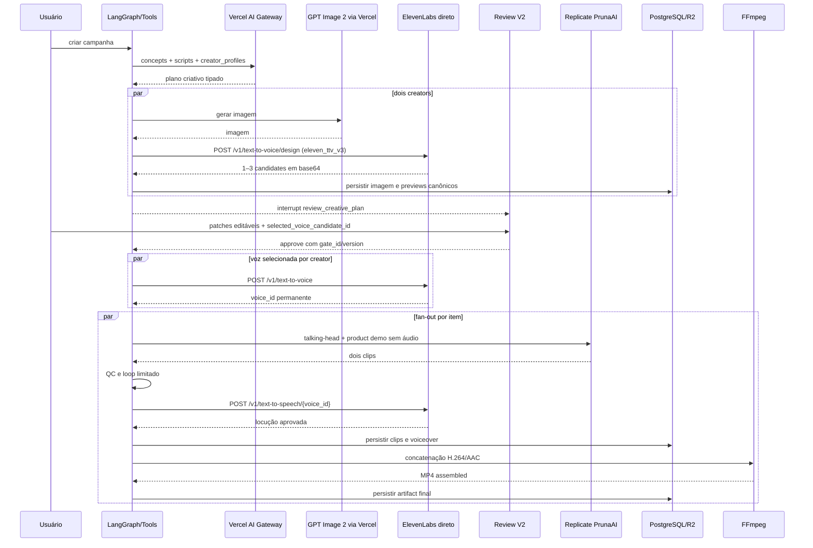

# Fluxo atual da pipeline — mindmap visual

Gerado a partir da topologia em `src/orchestrator/graph/builder.py` e do perfil live
em `config/`. A UI expõe cinco fases; os nodes abaixo permanecem internos.

## 1. Visão geral

```mermaid
mindmap
  root((Pipeline AI UGC))
    Configuração
      oferta audiência plataforma batch
      perfil mock staging ou live
    Plano criativo
      concepts
        LLM gera conceitos
      scripts
        LLM escreve roteiro por conceito
      creator_profiles
        agent define dois perfis e assignments
      roster
        gera e persiste imagem por creator
      voice_candidates
        deriva voice spec
        ElevenLabs Voice Design até 3 previews
        persiste URI canônica antes do checkpoint
    Revisão
      review_creative_plan único interrupt
      edita conceitos scripts e perfis
      seleciona uma voz por creator
      reroll voices volta só a voice_candidates
      editar voice_brief invalida seleção
    Produção e QC
      finalize_voices
        cria somente as vozes selecionadas
      fan-out Send
        um Item por conceito
        preserva assignment creator_id
      process_item
        LTX-2.3 Fast + LatentSync talking-head e product demo
        QC gate e loop limitado
        ElevenLabs TTS direto após QC
    Montagem
      ffmpeg_assembly
        concatena dois clips
        normaliza e muxa locução
      upscale passthrough
      terminal assembled
    Durabilidade
      PostgreSQL fonte canônica
      R2 ou S3 guarda mídia
      PostgresEffectLedger evita cobrança duplicada
      Queue ou SQS apenas wake-up
```

### Roteamento de regeneração

```mermaid
flowchart LR
    R[review] -->|approve| F[finalize_voices]
    R -->|regenerate concepts| C[concepts]
    R -->|regenerate scripts| S[scripts]
    R -->|regenerate creators| P[creator_profiles]
    R -->|regenerate voices| V[voice_candidates]
    V --> R
    C --> S --> P --> I[roster] --> V
    P --> I
    F --> O[production fan-out]
```

O reroll de voz preserva imagem, creator ID, assignments, conceitos e scripts. Cada
creator aceita no máximo dois rerolls; lotes anteriores continuam no histórico de
artifacts/custo, mas deixam de ser selecionáveis.

## 2. Sequência live

```mermaid
sequenceDiagram
    participant U as Usuário
    participant G as LangGraph/Tools
    participant LLM as Vercel AI Gateway
    participant IMG as GPT Image 2 via Vercel
    participant EL as ElevenLabs direto
    participant R as Review V2
    participant REP as Replicate PrunaAI
    participant DB as PostgreSQL/R2
    participant FF as FFmpeg

    U->>G: criar campanha
    G->>LLM: concepts + scripts + creator_profiles
    LLM-->>G: plano criativo tipado
    par dois creators
        G->>IMG: gerar imagem
        IMG-->>G: imagem
        G->>EL: POST /v1/text-to-voice/design (eleven_ttv_v3)
        EL-->>G: 1–3 candidates em base64
        G->>DB: persistir imagem e previews canônicos
    end
    G-->>R: interrupt review_creative_plan
    U->>R: patches editáveis + selected_voice_candidate_id
    R-->>G: approve com gate_id/version
    par voz selecionada por creator
        G->>EL: POST /v1/text-to-voice
        EL-->>G: voice_id permanente
    end
    par fan-out por item
        G->>REP: talking-head + product demo sem áudio
        REP-->>G: dois clips
        G->>G: QC e loop limitado
        G->>EL: POST /v1/text-to-speech/{voice_id}
        EL-->>G: locução aprovada
        G->>DB: persistir clips e voiceover
        G->>FF: concatenação H.264/AAC
        FF-->>G: MP4 assembled
        G->>DB: persistir artifact final
    end
```

Descrição integral de voz, oferta, roteiro e chaves não entram em logs/traces. A
observabilidade registra provider, modelo, status, hashes e request ID.

## 3. Stage → provider no perfil live

| Fase | Node | Provider | Efeito externo |
|---|---|---|---|
| Plano criativo | `concepts`, `scripts`, `creator_profiles` | `vercel_gateway_llm` | Claude via Vercel AI Gateway |
| Plano criativo | `roster` | `creator_vercel_elevenlabs_design` | GPT Image 2 via Vercel; sem voz ainda |
| Plano criativo | `voice_candidates` | `creator_vercel_elevenlabs_design` | Voice Design direto, `eleven_ttv_v3` |
| Revisão | `review` | gate `review_creative_plan` | Um interrupt versionado |
| Produção | `finalize_voices` | ElevenLabs direto | Cria somente candidato selecionado |
| Produção | tier `ltx`, `product_demo` | `replicate` | LTX-2.3 Fast + LatentSync sem áudio |
| Produção | `qc` | `integrity_qc` | Local; loop até `qc.max_attempts` |
| Produção | `voiceover` | ElevenLabs direto | TTS `eleven_turbo_v2_5` |
| Montagem | `assembly` | `ffmpeg_assembly` | Local, H.264 + AAC |
| Montagem | `upscale` | `passthrough_upscale` | No-op no perfil atual |

## 4. Efeitos, quotas e mídia

- As chaves idempotentes são `voice-design:{run_id}:{creator_id}:{hash}:{reroll}`,
  `voice-finalize:{run_id}:{creator_id}:{candidate_id}` e
  `voiceover:{run_id}:{item_id}:{script_hash}:{voice_ref}`.
- As quotas são `elevenlabs_voice_design_chars`, `elevenlabs_voice_slots` e
  `elevenlabs_tts_chars`. Execução durável também exige
  `ORCH_ENABLE_PAID_ADAPTERS=true`.
- Efeito concluído é reutilizado no resume. Falha comprovadamente pré-envio libera
  quota; timeout pós-envio fica `uncertain`. Finalização incerta reconcilia pelo nome
  determinístico e bloqueia se não houver resultado único.
- Estado/checkpoint/banco guardam apenas URIs canônicas. Base64 e URLs assinadas são
  transitórias; signed URLs aparecem somente na resposta destinada ao consumidor.
- `cost_by_stage` separa `voice_design`, `video`, `voiceover` e `assembly`, sem duplicar
  lotes de design após resume.
